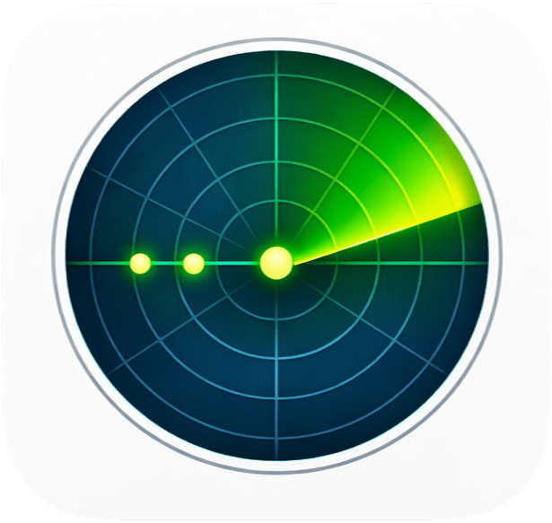

# ping-ui

<div align="center">
  
</div>

[](https://github.com/kojix2/ping-ui/actions/workflows/build.yml)


Desktop ping monitor written in Crystal.

## Build

```sh
shards build
```

Windows build is intended to work with Crystal for MinGW64. A GitHub Actions workflow is included to validate that the project still builds on Windows.

macOS app bundle and DMG:

```sh
./build-mac.sh
```

Generated artifacts are placed in dist/.

## Run

```sh
bin/ping
```

## Windows Status

- Windows support is implemented on a best-effort basis and should build against Crystal MinGW64.
- ICMP monitoring uses the Windows IcmpSendEcho API instead of raw sockets.
- Windows desktop notifications are not implemented yet.
- Packaging for Windows is not implemented yet.

## Storage

- macOS:
  Settings and history are stored under ~/Library/Application Support/ping-ui/
- Linux:
  Settings file: $XDG_CONFIG_HOME/ping-ui/settings.json or ~/.config/ping-ui/settings.json
  History database: $XDG_STATE_HOME/ping-ui/history.sqlite3, then $XDG_DATA_HOME/ping-ui/history.sqlite3, then ~/.local/state/ping-ui/history.sqlite3
- Windows:
  Settings file: %APPDATA%/ping-ui/settings.json
  History database: %LOCALAPPDATA%/ping-ui/history.sqlite3
- You can override the history database path with PING_UI_DB_PATH.
- Existing history databases in the legacy config location are migrated automatically when the new target path is first used.

## Data Handling

- Ping history is appended to the database.
- Old data is not deleted automatically.
